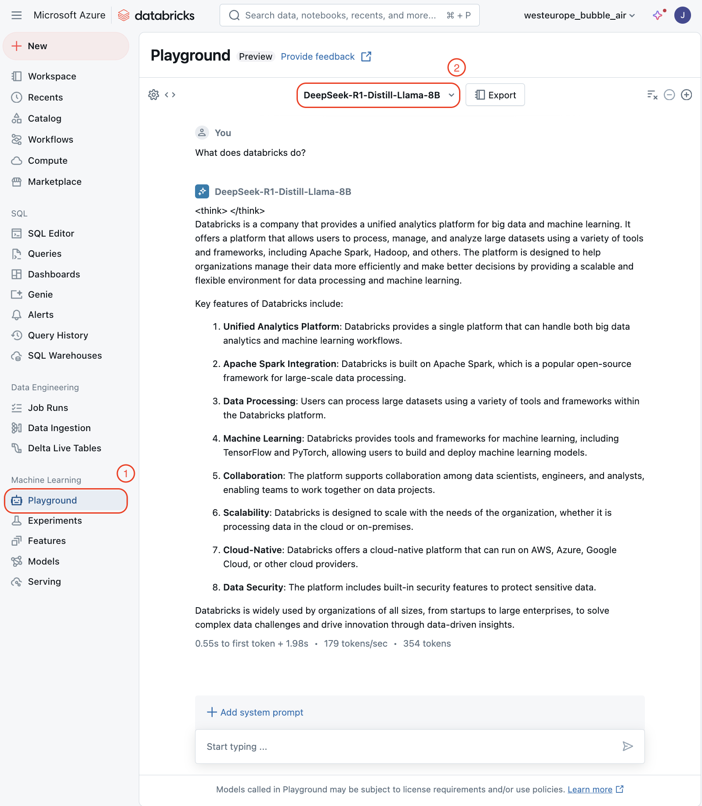

# Deploying DeepSeek R1 with Databricks Asset Bundles

- [Deploying DeepSeek R1 with Databricks Asset Bundles](#deploying-deepseek-r1-with-databricks-asset-bundles)
  - [Workflow Overview](#workflow-overview)
  - [Deployment Instructions](#deployment-instructions)
  - [Accessing the Deployed Model](#accessing-the-deployed-model)
    - [Databricks Playground](#databricks-playground)
    - [MLflow Integration](#mlflow-integration)
    - [Langchain Integration](#langchain-integration)
  - [Cleanup](#cleanup)
  - [Wrap up](#wrap-up)

Databricks has demonstrated [DeepSeek R1 on Databricks](https://www.databricks.com/blog/deepseek-r1-databricks). We are excited to announce that we have taken it a step further by introducing the Databricks Asset Bundle (DAB) for deploying DeepSeek R1 in your Databricks environment. DAB offers a more robust and standardized approach for faster and consistent deployment of Databricks resources.
The bundle supports the Llama 8B model and 70B variant. Currently the template is targeted at Azure, if you are interested in an version AWS please let us know.

## Workflow Overview

The Asset Bundle orchestrates a two-task deployment job:

1. **Model Acquisition and Registration:**
   The first task retrieves the model from HuggingFace and registers it as an MLflow experiment. We use the transformer flavor, which streamlines LLM deployment by enabling setup of a text-generation pipeline as an OpenAI-compatible endpoint through simple `llm/v1/chat` task configuration.
2. **Endpoint Deployment and Configuration:**
    The second task manages the serving infrastructure by deploying the registered model as a serving endpoint. It can either create a
new endpoint or update an existing one. The configuration includes cost-efficient auto-scaling, which scales to zero instances when
idle, ensuring you only incur charges during active usage.

## Deployment Instructions

Before starting, ensure you have installed and configured the [Databricks CLI](https://docs.databricks.com/en/dev-tools/cli/install.html) with your workspace credentials stored in a profile.

1. Initialize the asset bundle template:

```bash
databricks bundle init [url] --profile <profile>
```

2. Deploy and run the asset bundle to your workspace:

```bash
make deploy_and_run --profile <profile>
```

> Each task in the workflow can take max 30 minutes to complete. The workflow has a runtime notification if execution exceeds 1 hour and a 2-hour timeout.

## Accessing the Deployed Model

You can access the deployed model through multiple methods:

- The Databricks playground (recommended)
- Direct endpoint calls via MLflow
- Langchain integration

### Databricks Playground

In your Databricks workspace, navigate to the Machine Learning section and click on Playground. Select the model you have deployed, and you're ready to test it.



### MLflow Integration

Since the model is registered as an `llm/v1/chat` task, you can simply use the predict function to interact with the model. It will return a response in the same format as the OpenAI API.

```python
import mlflow.deployments
payload = {
    "messages": [{"role": "user", "content": "Please explain why the sky is blue."}],
    "temperature": 0.0,
    "max_tokens": 2048,
}
response = client.predict(
    endpoint="DeepSeek-R1-Distill-Llama-8B",  # Or replace with your exact serving endpoint url
    inputs=payload,
)
```

### Langchain Integration

LangChain is an open-source framework designed to simplify the development of applications using large language models (LLMs). It provides a standard interface for chaining together different components needed in LLM-powered applications, such as prompts, memory, indexes, and various tools.
Databricks offers LangChain integration through their langchain packages, enabling seamless interaction with hosted models. This integration enables [tracing among others](https://mlflow.org/docs/latest/llms/index.html#).

```python
from langchain_databricks import ChatDatabricks
import mlflow
mlflow.langchain.autolog()
chat_model = ChatDatabricks(
    endpoint="DeepSeek-R1-Distill-Llama-8B",
    temperature=0.0,
    max_tokens=2048,
)
chat_model.invoke("Please explain why the grass is green.")
```

## Cleanup
Although we utilize the scaling capabilities of Databricks to optimize costs, you can manually remove all resources after completing their use, treating them as cattle rather than pets.
To clean up the deployed model and related resources, apply the following command:

```bash
    make destroy_and_delete --profile [profile]
```

This will initiate the removal of all resources that are provisioned and deployed by the bundle and then delete the endpoint that was created during the workflow.

## Wrap Up
This tutorial demonstrated how Databricks Asset Bundles (DAB) simplify the deployment of DeepSeek R1.
Key takeaways include:

- **Streamlined Operations**: Deploy complex machine learning models with just a few commands, leveraging auto-scaling capabilities to optimize costs by scaling resources up or down as needed.
- **Flexible Integration**: Access your model through Databricks Playground, MLflow APIs, or LangChain, making it adaptable for various use cases ranging from simple testing to production applications.
- **Enterprise Features**: Benefit from automated MLflow versioning, monitoring, and OpenAI-compatible endpoints, ensuring a production-ready deployment that is both maintainable and scalable.
By using DABs, you can achieve reproducible deployments and enterprise-grade serving capabilities.

Have questions or feedback? We'd love to hear from you! 

Please open an issue on our GitHub repository #todo add link to gh or reach out to our team at <info@revodata.nl>